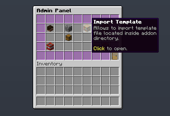

# MagicCobblestoneGenerator

**MagicCobblestoneGenerator** は単調な黒曜石ジェネレーターを、設定可能なブロックの素晴らしい安定した供給源に変えます！

作成・メンテナンス: [BONNe](https://github.com/BONNe)

{{ addon_description("MagicCobblestoneGenerator") }}

## インストール

1. アドオンの jar を BentoBox プラグインの addons フォルダに配置します
2. サーバーを再起動します
3. `/[admincmd] generator` コマンドを実行してアドオンを設定します

## 設定

デフォルトでは、アドオンは初回セットアップを簡単にするためにテンプレートファイルからすべてのデータをインポートしようとします。多くのアドオン設定は管理者 GUI で変更できますが、一部はできません。
最新の設定オプションと詳細な説明は[こちら](https://github.com/BentoBoxWorld/MagicCobblestoneGenerator/blob/develop/src/main/resources/config.yml)で確認できます。

テンプレートファイルは主にゲーム内編集 GUI を使いたくないユーザー向けです。ただし、テンプレートファイルは変更のたびに自動的にインポートされません。コマンドまたは管理者 GUI からインポートする必要があります。

??? question "テンプレートファイルの構造"
    ```
    # Start the listing of all generator tiers.
    tiers:
      # Unique Id for generator. Used in internal storage and accessing to each generator data.
      generator_unique_id: 
        # Display name for users. Supports colour codes.
        # Default value: generator_unique_id without _
        name: "Something fancy"
        # Description in lore message. Supports colour codes.
        # Can be defined empty by replacing eveything with [].
        # Default value: []
        description: -|
          First Line Of lore Message
          &2Second Line Of lore Message
        # Icon used in GUI's. Number at the end allows to specify stack size for item.
        # Default value: Paper.
        icon: "PAPER:1"
        # Generator type: which vanilla lava mechanic this tier replaces.
        # COBBLESTONE, STONE, BASALT, COBBLESTONE_OR_STONE, BASALT_OR_COBBLESTONE,
        # BASALT_OR_STONE or ANY. See the "Generator types" section below.
        # Default value: COBBLESTONE
        type: COBBLESTONE
        # Indicates if genertor is default generator. Default generators ignores requirement section.
        # It is activated for each new island. Can be only one per each generator type.
        # Default value: false
        default: false
        # Users selects active generators.
        # Priority indicates which generator will be used
        # if multiple of them fulfills requirements.
        # Default value: 1
        priority: 1
        # There are several requirements that can be defined here.
        requirements:
          # Can define minimal island level for generator to work. Required Level Addon.
          # Default value: 0
          island-level: 10
          # List of required permissions for users to select this generator.
          # Default value: []
          required-permissions: []
          # List of required biomes for generator to work.
          # Empty means that there is no limitation in which biome generator works.
          # Default value: [].
          required-biomes: []
          # Cost for purchasing this generator. Requires Vault and any economy plugin.
          # Currently implemented by clicking on purchase icon in generator view GUI.
          # Default value: 0
          purchase-cost: 5.0
        # Cost for activating current generator tier. Requires Vault and any economy plugin.
        # Will be payed only on active switching between generators.
        # Default value: 0.
        activation-cost: 0.0
        # Materials and their chances. Use actual blocks please.
        # Chance supports any positive number, including double value.
        # Everything in the end will be normalized.
        # Default value: []
        blocks:
          FIRST_BLOCK_NAME_ID: NUMBER
          SECOND_BLOCK_NAME_ID: NUMBER
        # Treasure that has a chance to be dropped when block is generated.
        # ONLY on generation, not on block break.
        # Default value: []
        treasure:
          # Chance from 0 till 1. 0 - will not be possible to get a treasure.
          # Default value: 0
          chance: 0.001
          # Materials that can be dropped. Applies to the same rules as block section.
          # Default value: []
          material:
            FIRST_BLOCK_NAME_ID: NUMBER
            SECOND_BLOCK_NAME_ID: NUMBER
          # Maximal amount of items dropped.
          # It will be from 1 till defined amount.
          # Default value: 1
          amount: 1
    
    # Start the listing of all bundles
    bundles:
      # bundle_id
      bundle_unique_id:
        # Display name for users
        name: "Something fancy"
        # Description in lore message. Supports colour codes.
        # Can be defined empty by replacing eveything with [].
        # Default value: []
        description: -|
          First Line Of lore Message
          &2Second Line Of lore Message
        # Icon used in GUI's. Number at the end allows to specify stack size for item.
        # Default value: Paper.
        icon: "PAPER:1"
        # List of generators that bundle will work have access.
        generators:
          - generator_id_1
          - generator_id_2
    ```

### ジェネレーター型（ティアが置き換わるマグマのメカニクス）

Minecraftはマグマからブロックを4つの異なる方法で作成し、ジェネレーターティアはそのタイプがカバーするものだけに対して起動します。これは、ジェネレーターが*どこ*使用できるかを制御する主な設定です：

| バニラのメカニクス | バニラが作成するブロック | ジェネレーター型 |
|---|---|---|
| マグマ**ソース**が水に接触 | 黒曜石 | *アドオンで処理されない* |
| **流れるマグマ**が同じレベルの水に接触 | 丸石 | `COBBLESTONE` |
| **流れるマグマ**が水に落ちる | 石 | `STONE` |
| **流れるマグマ**がソウルソイルの隣の青い氷に落ちる | 玄武岩 | `BASALT` |

型はジェネレーターティアごと、管理者GUI — `/[admin] generator` → ティアを選択 → **Type**ボタンに設定されます。背後にあるメカニクスについてのヒント付きのすべてのタイプをリストすることで、ピッカーを開く — または、テンプレートファイルの`type:`キーで。結合型`COBBLESTONE_OR_STONE`、`BASALT_OR_COBBLESTONE`、`BASALT_OR_STONE`、`ANY`を使用すると、ティアが複数のメカニクスに対して起動します。

!!! warning "`STONE`ジェネレーターは任意の水体で動作"
    `STONE`ジェネレーターは、プレイヤーがマグマを水に注ぐことができるどこでも起動します — アイランド保護範囲内の外洋を含む。**AcidIsland**のような水が多いゲームモードでは、1つのマグマバケツで大量の外洋をジェネレーターブロックに変換し、アイランドレベルをアップグレードできます。2つの方法がそれを防止します：

    - **プレイヤーに`STONE`ティアを与えない。** `COBBLESTONE`および/または`BASALT`タイプのみを使用して、ブロック生成が適切に構築されたジェネレーターを必要とするようにします。
    - **高さ範囲を制限する。** `STONE`ティアに海面を除くが洞窟や水の上高くで動作するミニマムとマキシマムYを与える。[ブロックごとの高さ範囲](#ブロックごとの高さ範囲)を参照してください。

### ジェネレーター排出量制限（レート制限）

**2.8.0**以降、ジェネレーターは一定の期間内に一定数のブロックのみを生成してからクールダウンに入るようにキャップできます — 完全に自動化されたAFKファームを阻止するのに役立ちます。この機能は**オプトイン式で、デフォルトは無効**（制限値`0`）であり、既存のセットアップは有効にするまで影響を受けません。ジェネレーターが一時的にクールダウン中の場合、プレイヤーは`generator-exhausted`メッセージを受け取ります。

=== "exhaustion.limit"
    !!! summary "説明"
        ジェネレーターが単一の排出量制限期間中に生成できるデフォルトブロック数。`0`以下は制限を無効にします（デフォルト）。各ジェネレーターティアはティアごとの`exhaustion-limit`キーでこれをオーバーライドできます（下記参照）。

        デフォルト: `0`

=== "exhaustion.period"
    !!! summary "説明"
        排出量制限期間の長さ、**分**単位。ブロック数は各期間の終了時にリセットされます。

        デフォルト: `60`

=== "exhaustion.cooldown"
    !!! summary "説明"
        排出量制限に達した後、ジェネレーターがクールダウン状態にとどまる長さ、**分**単位。

        デフォルト: `1440`（24時間）

=== "exhaustion.notification-cooldown"
    !!! summary "説明"
        同じプレイヤーに表示される2つの排出量警告メッセージ間の最小時間、**秒**単位。

        デフォルト: `60`

!!! tip "ティアごとの制限"
    各ジェネレーターティアはジェネレーターテンプレート（および管理者GUIで）の`exhaustion-limit`キーでグローバル制限をオーバーライドできるため、異なるティアを独立して制限できます。

### ブロック高さ範囲

**2.8.0**以降、ジェネレーターと—個々のブロック内で—最小および最大Yレベルに制限でき、異なる高さで異なるマテリアルが生成されます。新しいGUIボタンを使用すると、管理者は範囲を設定およびクリアでき、ジェネレーターロアはプレイヤーに各ジェネレーターの動作場所を示します。高さ範囲のないレガシーテンプレートは完全に互換性があります。

### ロック解除の進行と要件

**2.9.0**以降、ジェネレーターはより豊かな要件の背後にゲートされ、ティアのフラットなリストではなく、適切なアンロックツリーを設計できます。これらはすべて、管理者GUIのジェネレーター編集パネルから設定されます：

- **前提条件ジェネレーター** — 複数段階の進行を構築し、最初に1つ以上の他のジェネレーターをアンロックする必要があります。
- **AOneBlockフェーズ要件** — AOneBlockゲームモードでは、ジェネレーターを特定のアイランドフェーズの背後にゲートし、アイランドが進むにつれてティアのロックが解除されます。
- **OneBlockブロック数要件** — OneBlockアイランドで破壊されたブロック数の背後にジェネレーターをゲートします。
- **アンロック時に有効化** — ジェネレーターがアンロックされた瞬間に自動的に有効化するジェネレーターごとのオプション。プレイヤーがGUIへのアクセスを節約できます。
- **購入確認** — ジェネレーターを購入するときにお金が取られる前に、明確な確認を要求するオプション。誤った購入を防止します。

=== "lose-tiers-on-level-loss"
    !!! summary "説明"
        *2.9.0で追加。* アイランドレベルによってアンロックされたジェネレーターがアイランドレベルが後で要件を下回る場合に再度ロックされる、2.0.0前の動作を復元します。購入されたティアは常に保持されます — 無料でレベルアンロックされたティアのみが再ロックされます。アップグレード後の最初のロード時に`config.yml`に自動的に書き込まれます。

        デフォルト: `false`

!!! warning "権限ゲートされたジェネレーターは今リボーク（取り消し）されます"
    **2.9.0**以降、権限によってアンロックされたジェネレーターは再確認され、現在のオンラインオーナーが必要な権限を保持しなくなった場合（例：所有権の移転後）、アイランドのアンロック済みおよびアクティブなリストから**リボーク**されます。購入されたティアは保持されるため、権限が再び取得されるとアクセスが返ります。オフラインオーナーは影響を受けません。以前はそのような付与は恒久的でした。

### カスタムブロック出力 (ItemsAdder, CraftEngine, Oraxen, Nexo)

**2.10.0**以降、ジェネレーターティアは、バニラマテリアルだけでなく、ItemsAdder、CraftEngine、OraxenおよびNexoからのカスタムブロックを生成できます — 例えば、ダイヤモンドで装飾されたItemsAdderの鉱石は、他のすべてのものと一緒に加重ランダムミックスにロールされます。これらのプラグインへのすべてのアクセスはBentoBoxコアフックを通じてルーティングされるため、アドオンは直接それらに依存しません。

- ブロックは文字列IDとして保存されます：`COBBLESTONE`のようなバニラ名、またはプロバイダー接頭辞付きID `itemsadder:namespace:id`、`craftengine:namespace:id`、`oraxen:id`、`nexo:id`。**既存のデータベースおよびテンプレートは変更されずにロードされます。**
- 管理者編集パネルは**カスタムブロックの追加**ボタンを獲得します — チャットでIDを入力し、フックレジストリに対して検証されます。パネルはカスタムブロックをプロバイダー自身のテクスチャと表示名でレンダリングします。
- ピックアップされたカスタムブロックが生成時に利用できない場合（プロバイダーまたはブロックが不足している場合）、ジェネレーターはバニラブロックにフォールバックし、サイレント失敗ではなく`/[admin_command] generator why`経由で理由を報告します。テンプレートインポートの未登録カスタムブロックは警告付きでインポートされるため、テンプレートはサーバー間で移植可能なままです。

!!! note "プロバイダーの可用性"
    ItemsAdderとCraftEngineは今日ブロックを生成します。OraxenとNexoは配線されており、一致するBentoBoxコアフックが出荷されると生成します（BentoBox 3.20.0はNexoフックと`OraxenHook.placeBlock`を追加します）。

!!! warning "BentoBox 3.19.1以降が必須"
    2.10.0はBentoBox 3.19.1で追加されたカスタムブロックフックAPIに依存し、**古いコアではロードされません**。このjarをドロップする前にBentoBoxを更新してください。

## コマンド

!!! tip "ヒント"
    `[player_command]` と `[admin_command]` は実行中のゲームモードによって異なるコマンドです。
    ゲームモードの `config.yml` ファイルにはこれらの値を変更するオプションがあります。
    例えば BSkyBlock では、デフォルトの `[player_command]` は `island`、デフォルトの `[admin_command]` は `bsbadmin` です。
    このアドオンではアドオンの `config.yml` でプレイヤーコマンドのエイリアスを変更できることに注意してください。

=== "プレイヤーコマンド"
    - `/[player_command] generator`: ジェネレーター選択 GUI にアクセスします。
    - `/[player_command] generator view <generator>`: 特定のジェネレーターの詳細ビューにアクセスします。
    - `/[player_command] generator activate <generator> [false]`: 特定のジェネレーターを有効化（または無効化）します。
    - `/[player_command] generator buy <generator>`: 特定のジェネレーターを購入します。

=== "管理者コマンド"
    - `/[admin_command] generator`: アドオン管理者 GUI にアクセスします
    - `/[admin_command] generator import`: デフォルトのテンプレートファイル `/plugins/BentoBox/addons/MagicCobblestoneGenerator/generatorTemplate.yml` をインポートします。
    - `/[admin_command] generator database import <file>`: エクスポートされたデータベース `<file>` をインポートします。
    - `/[admin_command] generator database export <file>`: データベースを `/plugins/BentoBox/addons/MagicCobblestoneGenerator/` フォルダ内の `<file>` にエクスポートします。
    - `/[admin_command] generator why <player>`: 各プレイヤーのジェネレーターの問題を発見するためのデバッグコマンドです。
    - `/[admin_command] generator reset <player>`: プレイヤーのアイランドジェネレーターデータ — アンロック済み、購入済み、およびアクティブなジェネレーター — を確認プロンプト後にリセットします。*(2.9.0で追加。)*

## 権限

!!! tip "ヒント"
    `[gamemode]` は実行中のゲームモードによって異なるプレフィックスです。
    プレフィックスはゲームモード名の小文字です。例えば BSkyBlock を使用している場合、プレフィックスは `bskyblock` です。
    同様に AcidIsland を使用している場合、プレフィックスは `acidisland` です。

=== "プレイヤー権限"
    - `[gamemode].stone-generator` - プレイヤーが '/[player_command] generator' コマンドとそのサブコマンドを使用できます。
    - `[gamemode].stone-generator.active-generators.3` - アイランドオーナーが持てるアクティブなジェネレーターの最大数を設定します。3 は任意の正の整数に置き換えられます。これは例です。
    - `[gamemode].stone-generator.max-range.30` - ジェネレーターが動作し続ける最大距離を設定します。30 は任意の正の整数に置き換えられます。これは例です。
    - `[gamemode].stone-generator.bundle.[bundle_id]` - ユーザー所有アイランドで使用するバンドルを指定します。
    
=== "管理者権限"
    - `[gamemode].admin.stone-generator` - プレイヤーが '/[admin_command] generator' コマンドとそのサブコマンドを使用できます。
    - `[gamemode].admin.stone-generator.why` - プレイヤーがデバッグコマンド '/[admin_command] why generator <player>' を使用できます。
    - `[gamemode].admin.stone-generator.database` - プレイヤーが '/[admin_command] generator database' コマンドとそのサブコマンドを使用できます。
    
??? question "何か不足していますか？"
    このアドオンの [addon.yml](https://github.com/BentoBoxWorld/MagicCobblestoneGenerator/blob/develop/src/main/resources/addon.yml) ファイルで権限の完全なリストを確認できます。  
    もし本当に不足しているものがあれば、お知らせください！


## プレースホルダー

{{ placeholders_source(source="MagicCobblestoneGenerator") }}


## よくある質問

??? question "機能 X を追加してもらえますか？"
    [こちら](https://github.com/BentoBoxWorld/MagicCobblestoneGenerator/issues)のリストに追加してください。

??? question "新しいジェネレータートierを追加するにはどうすればいいですか？"
    現在、アドオンは新しいジェネレーターを追加する 3 つの方法をサポートしています:
    
    - `/[admin] generator` コマンドで利用できるゲーム内 GUI を使用する。
    - テンプレートファイルにジェネレーターを追加する。
    - エクスポートされたデータベースファイルにジェネレーターを追加する。

??? question "テンプレート/データベースファイルにジェネレーターを追加しましたが、ゲーム内に表示されません。"
    複数のゲームモードでの設定を容易にするため、ジェネレーターは内部データベースに保存されます。テンプレートまたはデータベースファイルを編集した後、それらをそのメモリにインポートする必要があります。管理者 GUI で `Import Template` または `Import Database` ボタンをクリックすることで実行できます。
    
    {: loading=lazy }
    {: loading=lazy }

??? question "管理者 GUI にジェネレーターが表示されますが、プレイヤーには見えません。"
    おそらく「デプロイ」ステータスが原因です。管理者がジェネレーターを追加している間にプレイヤーがアクティブ化しようとする問題を避けるため、ジェネレーターはデプロイされておらず誰も使用できません。管理者 GUI でジェネレーターを編集し、ジェネレーター編集 GUI のレバーをクリックすることで有効化できます。
    {: loading=lazy }

??? question "プレイヤーが外洋でマグマバケツを使ってブロックを生成しています。どうすれば止められますか？"
    それは設計通りに動作する`STONE`ジェネレーターです。バニラはマグマが水に流れ込むときはいつでも水を石に変えるため、`STONE`ティアはプレイヤーが到達できるすべての水、外洋を含む、に対して起動します。`STONE`ティアの配信をやめて、`COBBLESTONE`および/または`BASALT`タイプのみを代わりに使用するか、海面を除くが洞窟や水の上高い高さ範囲を与えてください。[ジェネレーター型](#ジェネレーター型（ティアが置き換わるマグマのメカニクス）)を参照してください。

??? question "トレジャーとは何ですか？"
    トレジャーはブロック生成時にドロップされるものです。各ジェネレーターに追加のカスタマイズを与えることができます。

??? question "バンドルとは何ですか？"
    バンドルは各アイランドのエクスペリエンスをさらにカスタマイズできる機能です。バンドルがアイランドに割り当てられると、そのアイランドのプレイヤーはそのバンドルのジェネレーターのみ使用できます。

??? question "ジェネレーターの説明に必要な権限の表示を無効にできますか？"
    はい、アドオンは各ジェネレーターの表示に多くのカスタマイズオプションを提供しています。ロケールファイルにあります:
    ```
          # Generator lore message generator. All elements in generator lore is generated
          # based on section below.
          generator:
            # Main lore element content. If you do not want to display treasures at all,
            # just remove them from [treasures] section.
            # [description] comes from each generator tier.
            # Lore does not supports colour codes. Each object separate supports.
            lore: |-
              [description]
              [blocks]
              [treasures]
              [type]
              [requirements]
              [status]
            # Generates [blocks] section
            blocks:
              # First line in blocks section. Empty line will not be displayed.
              title: "&7&l Blocks:"
              # Each block and its value under title. Cannot be empty.
              # Supports [number], [#.#], [#.##], [#.###], [#.####], [#.#####]
              value: "&8 [material] - [#.##]%"
            # Generates [treasures] section
            treasures:
              # First line in blocks section. Empty line will not be displayed.
              title: "&7&l Treasures:"
              # Each treasure and its value under title. Cannot be empty.
              # Supports [number], [#.#], [#.##], [#.###], [#.####], [#.#####]
              value: "&8 [material] - [#.####]%"
            # Generates [requirements] section
            requirements:
              # Allows to change order and content of requirements message.
              description: |-
                [biomes]
                [level]
                [missing-permissions]
              # Generates [level] message.
              level: "&c&l Required Level: &r&c [number]"
              # Generates [missing-permission] message title.
              permission-title: "&c&l Missing Permissions:"
              # Generates [missing-permission] message values.
              permission: "&c  -[permission]"
              # Generates [biomes] message title.
              biome-title: "&7&l Operates in:"
              # Generates [biomes] message values.
              biome: "&8 [biome]"
              # Generates [biomes] message for All Biomes.
              any: "&7&l Operates in &e&o all &r&7&l biomes"
            # Generates [status] section
            status:
              # Message that is showed for Locked generators.
              locked: "&c Locked!"
              # Message that is showed for generators that is not deployed.
              undeployed: "&c Not Deployed!"
              # Message that is showed for Active generators.
              active: "&2 Active"
              # Message that is showed for generators that required purchasing.
              purchase-cost: "&e Purchase Cost: $[number]"
              # Message that is showed for generators that has activation cost.
              activation-cost: "&e Activation Cost: $[number]"
            # Generates [type] section
            type:
              title: "&7&l Supports:"
              cobblestone: "&8 Cobblestone Generators"
              stone: "&8 Stone Generators"
              basalt: "&8 Basalt Generators"
              any: "&7&l Supports &e&o all &r&7&l generators"
    ```

## 変更履歴

??? warning "v2.10.0 の新機能 — カスタムブロック、BentoBox 3.19.1 が必須"
    **リリース日:** 2026-07-11

    ジェネレーターは他のプラグインからカスタムブロックをドロップできるようになりました。BentoBoxコアフックを通じてルーティングされます。

    - 🔺 **カスタムブロックのサポート。** ジェネレーターティアはバニラマテリアルと同様に、**ItemsAdder、CraftEngine、OraxenおよびNexo**からのブロックを生成できます。ブロックは文字列IDとして保存されます（`COBBLESTONE`、または`itemsadder:namespace:id`、`craftengine:namespace:id`、`oraxen:id`、`nexo:id`）。既存のデータベースは変更されずにロードされます。[#103](https://github.com/BentoBoxWorld/MagicCobblestoneGenerator/issues/103)を修正。上記の設定セクションを参照してください。
    - ✨ **カスタムブロック追加パネルボタン** チャット入力検証付き、フックレジストリに対して検証されます。パネルはカスタムブロックをプロバイダーのテクスチャと名前でレンダリングします。利用不可のカスタムブロックはバニラブロックにフォールバックし、サイレント失敗ではなく`/why`レポートで報告されます。ItemsAdderとCraftEngineは今日生成されます。OraxenとNexoはBentoBox 3.20.0のフックが存在すると生成されます。
    - 🐛 **トレジャーチャンス編集が保存されるようになりました。** 管理パネルのトレジャーチャンス編集が非推奨の`treasureChanceMap`の代わりに`treasureItemChanceMap`に書き込まれていたため、編集が失われていました — 修正されました。
    - ⚙️ **テンプレートがカスタムブロックを受け入れます。** `generatorTemplate.yml`はクォートされたプロバイダー接頭辞付きブロックキーを受け入れるようになりました。既存のセットアップにはアクション不要です。未登録のカスタムブロックは警告付きでインポートされます。
    - 🔡 **ロケール注記:** カスタムブロック UIの新しい`en-US.yml`キーが追加されました。ロケールファイルを再生成または更新して、新しい文字列を取得してください。
    - 🔺 **BentoBox 3.19.1以降が必須。** このリリースが呼び出すカスタムブロックフック API は3.19.1からのみ利用可能です。アドオンは古いコアではロードされません。最初にBentoBoxを更新してください。

    [Release v2.10.0](https://github.com/BentoBoxWorld/MagicCobblestoneGenerator/releases/tag/2.10.0)

??? warning "v2.9.0 の新機能 — 権限ゲートされたジェネレーターは今リボーク（取り消し）されます"
    **リリース日:** 2026-07-08

    豊かなアンロック進行とまたはいくつかの管理/API改善が追加されます。

    - 🔒 **前提条件ジェネレーター。** 1つ以上の他のジェネレーターの背後にジェネレーターをゲートし、設計された進行でティアのロックを解除します。新しい管理者GUIセレクターで設定されます。[#88](https://github.com/BentoBoxWorld/MagicCobblestoneGenerator/issues/88)を修正。
    - 🧱 **OneBlock / AOneBlockゲーティング。** OneBlockアイランドで特定のAOneBlockフェーズまたはブロック数を要求し、ジェネレーターが利用可能になる前に。[#121](https://github.com/BentoBoxWorld/MagicCobblestoneGenerator/issues/121)、[#117](https://github.com/BentoBoxWorld/MagicCobblestoneGenerator/issues/117)を修正。
    - ⚙️ **レベル低下時にティアを再ロック。** 新しい`lose-tiers-on-level-loss`設定（デフォルト`false`）はアイランドのレベルが低下した場合、レベルアンロックされたジェネレーターを再ロックします。購入されたティアは常に保持されます。[#118](https://github.com/BentoBoxWorld/MagicCobblestoneGenerator/issues/118)を修正。
    - ✨ **アンロック時に有効化。** ジェネレーターはアンロックされた瞬間に自動的に有効化できるようになりました。[#106](https://github.com/BentoBoxWorld/MagicCobblestoneGenerator/issues/106)を修正。
    - 💰 **購入確認。** ジェネレーター購入前にプレイヤーに確認を要求します。[#109](https://github.com/BentoBoxWorld/MagicCobblestoneGenerator/issues/109)を修正。
    - 🛠️ **管理者データリセット。** 新しい`/[admin_command] generator reset <player>`コマンドは確認プロンプト後にプレイヤーのアンロック済み、購入済み、およびアクティブなジェネレーターをリセットします。[#149](https://github.com/BentoBoxWorld/MagicCobblestoneGenerator/issues/149)を修正。
    - 🔌 **新しいキャンセル可能APIイベント** `GeneratorPreBuyEvent`および`GeneratorTreasureDropEvent`は他のアドオンがフックインできます（下記のAPIセクションを参照）。
    - 🔺 **動作変更:** 権限ゲートされたジェネレーターは、アイランドのオンラインオーナーが必要な権限を保持しなくなった場合（例：所有権の移転後）、**リボーク**されるようになりました。購入されたティアは保持されるため、権限が再び取得されるとアクセスが返ります。
    - 🔡 **ロケール注記:** 前提条件セレクター、アンロック時に有効化、購入確認、管理者リセットコマンド、およびOneBlock/AOneBlock要件メッセージの新しい`en-US.yml`キーが追加されました。ロケールファイルを再生成または更新して、新しい文字列を取得してください。

    [Release v2.9.0](https://github.com/BentoBoxWorld/MagicCobblestoneGenerator/releases/tag/2.9.0)

??? warning "v2.8.0 の新機能 — BentoBox 3.14.0 / Java 21 が必須"
    **リリース日:** 2026-07-03

    - ⚙️ **ジェネレーター排出量制限。** オプションで、ジェネレーターが期間ごとに生成するブロック数をレート制限し、制限に達するとクールダウンします。グローバルに（`config.yml`の`exhaustion.*`）およびジェネレーターティアごと（テンプレートの`exhaustion-limit`）で設定可能。オプトイン式で、デフォルトは無効。上記の設定セクションを参照してください。
    - **ブロック高さ範囲。** ジェネレーターと個々のブロックを最小/最大Yレベルに制限し、新しいGUIコントロールとプレイヤー向けロアがあります。
    - 🔡 **新しいプレースホルダー** `[gamemode]_magiccobblestonegenerator_generator_exhaustion_status`と`[gamemode]_magiccobblestonegenerator_exhausted_generator_names`が排出量状態を公開します。
    - 🔡 🔺 **MiniMessageロケール + 13言語の追加。** すべてのロケールファイルがレガシーの`&`/`§`カラーコードからMiniMessage（BentoBox 3.14がネイティブにレンダリング）に変換され、cs、hr、hu、id、it、ja、ko、lv、nl、pt、pt-BR、ro、zh-HKの翻訳が追加されました — BentoBoxコアに一致する合計24ロケール。`locales/*.yml`に対してカスタム編集を行った場合は、MiniMessageフォーマットで再度適用してください（またはファイルを削除して新しいものを再生成してください）。
    - 🔺 **BentoBox 3.14 / Java 21 向けに近代化。** 現在のBentoBox APIとPaperに更新され、テストスイートはMockBukkitに移行しました。このリリースは古いBentoBoxまたはJavaバージョンでは読み込まれません — 最初にBentoBoxを更新してください。

    [Release v2.8.0](https://github.com/BentoBoxWorld/MagicCobblestoneGenerator/releases/tag/2.8.0)

## 翻訳

{{ translations("MagicCobblestoneGenerator") }}

## API

MagicCobblestoneGenerator 2.4.0 および BentoBox 1.17 以降、他のプラグインは MagicCobblestoneData アドオンのデータに直接アクセスできます。ただし、アドオンリクエストは依存関係を多くしたくないプラグインにとって依然として良い解決策です。

### Maven 依存関係
MagicCobblestoneGenerator は他のプラグイン向けの API を提供しています。これはバージョン 2.5.0 以降に対応しています。

!!! note "注意"
    Maven POM.xml に MagicCobblestoneGenerator の依存関係を追加します:

    ```xml
        <repositories>
            <repository>
                <id>codemc-repo</id>
                <url>https://repo.codemc.io/repository/bentoboxworld/</url>
            </repository>
        </repositories>
        
        <dependencies>
            <dependency>
                <groupId>world.bentobox</groupId>
                <artifactId>magiccobblestonegenerator</artifactId>
                <version>2.5.0</version>
                <scope>provided</scope>
            </dependency>
        </dependencies>
    ```
最新の MagicCobblestoneGenerator バージョンを使用してください。

MagicCobblestoneGenerator の JavaDocs は[こちら](https://ci.codemc.io/job/BentoBoxWorld/job/MagicCobblestoneGenerator/ws/target/apidocs/index.html)で確認できます。

### イベント

=== "GeneratorActivationEvent"
    !!! summary "説明"
        プレイヤーがアイランドのジェネレーターを有効化/無効化したときに発火するイベントです。
        このイベントはキャンセル可能です。

        クラスへのリンク: [GeneratorActivationEvent](https://github.com/BentoBoxWorld/MagicCobblestoneGenerator/blob/develop/src/main/java/world/bentobox/magiccobblestonegenerator/events/GeneratorActivationEvent.java)

    !!! question "変数"
        - `String islandUUID` - 対象アイランドの ID。
        - `UUID targetPlayer` - ジェネレーターの有効化をトリガーしたプレイヤーの ID。
        - `String generator` - 有効化されたジェネレーターの名前。
        - `String generatorID` - 有効化されたジェネレーターの ID。
        - `boolean activate` - ジェネレーターが有効化または無効化されたかを示すブール値。

        
    !!! example "コード例"
        ```java
        @EventHandler(priority = EventPriority.LOW)
        public void onGeneratorActivationChange(GeneratorActivationEvent event) {
            UUID user = event.getTargetPlayer();
            String island = event.getIslandUUID();

            String generator = event.getGenerator();
            String generatorID = event.getGeneratorID();
            boolean activate = event.isActivate();
        }
        ```

=== "GeneratorUnlockEvent"
    !!! summary "説明"
        プレイヤーがアイランドで新しいジェネレーターをアンロックしたときに発火するイベントです。
        このイベントはキャンセル可能です。

        クラスへのリンク: [GeneratorUnlockEvent](https://github.com/BentoBoxWorld/MagicCobblestoneGenerator/blob/develop/src/main/java/world/bentobox/magiccobblestonegenerator/events/GeneratorUnlockEvent.java)

    !!! question "変数"
        - `String islandUUID` - 対象アイランドの ID。
        - `UUID targetPlayer` - ジェネレーターのアンロックをトリガーしたプレイヤーの ID。
        - `String generator` - アンロックされたジェネレーターの名前。
        - `String generatorID` - アンロックされたジェネレーターの ID。

        
    !!! example "コード例"
        ```java
        @EventHandler(priority = EventPriority.LOW)
        public void onGeneratorUnlock(GeneratorUnlockEvent event) {
            UUID user = event.getTargetPlayer();
            String island = event.getIslandUUID();

            String generator = event.getGenerator();
            String generatorID = event.getGeneratorID();
        }
        ```

=== "GeneratorBuyEvent"
    !!! summary "説明"
        プレイヤーがアイランドで新しいジェネレーターを購入したときに発火するイベントです。
        このイベントはキャンセル**不可能**です。

        クラスへのリンク: [GeneratorBuyEvent](https://github.com/BentoBoxWorld/MagicCobblestoneGenerator/blob/develop/src/main/java/world/bentobox/magiccobblestonegenerator/events/GeneratorBuyEvent.java)

    !!! question "変数"
        - `String islandUUID` - 対象アイランドの ID。
        - `UUID targetPlayer` - ジェネレーターを購入したプレイヤーの ID。
        - `String generator` - 購入されたジェネレーターの名前。
        - `String generatorID` - 購入されたジェネレーターの ID。

        
    !!! example "コード例"
        ```java
        @EventHandler(priority = EventPriority.LOW)
        public void onGeneratorBuy(GeneratorBuyEvent event) {
            UUID user = event.getTargetPlayer();
            String island = event.getIslandUUID();

            String generator = event.getGenerator();
            String generatorID = event.getGeneratorID();
        }
        ```

=== "GeneratorPreBuyEvent"
    !!! summary "説明"
        ジェネレーターが購入される**前に**発火するイベント。購入をキャンセルまたは検査できます。共有`GeneratorEvent`基本クラスを拡張します。
        このイベントはキャンセル可能です。

        2.9.0バージョン以降。

        クラスへのリンク: [GeneratorPreBuyEvent](https://github.com/BentoBoxWorld/MagicCobblestoneGenerator/blob/develop/src/main/java/world/bentobox/magiccobblestonegenerator/events/GeneratorPreBuyEvent.java)

    !!! question "変数"
        - `String islandUUID` - 対象アイランドの ID。
        - `UUID targetPlayer` - ジェネレーターを購入しているプレイヤーの ID。
        - `String generator` - 購入されるジェネレーターの名前。
        - `String generatorID` - 購入されるジェネレーターの ID。

        
    !!! example "コード例"
        ```java
        @EventHandler(priority = EventPriority.LOW)
        public void onGeneratorPreBuy(GeneratorPreBuyEvent event) {
            UUID user = event.getTargetPlayer();
            String island = event.getIslandUUID();
            String generatorID = event.getGeneratorID();

            // 必要に応じて購入を拒否する
            if (someCondition) {
                event.setCancelled(true);
            }
        }
        ```

=== "GeneratorTreasureDropEvent"
    !!! summary "説明"
        トレジャーがジェネレーターからドロップしようとするときに発火するイベント。ドロップをキャンセルまたは変更できます。共有`GeneratorEvent`基本クラスを拡張します。
        このイベントはキャンセル可能です。

        2.9.0バージョン以降。

        クラスへのリンク: [GeneratorTreasureDropEvent](https://github.com/BentoBoxWorld/MagicCobblestoneGenerator/blob/develop/src/main/java/world/bentobox/magiccobblestonegenerator/events/GeneratorTreasureDropEvent.java)

    !!! question "変数"
        - `String islandUUID` - 対象アイランドの ID。
        - `UUID targetPlayer` - トレジャーがドロップするプレイヤーの ID。
        - `String generator` - トレジャーをドロップするジェネレーターの名前。
        - `String generatorID` - トレジャーをドロップするジェネレーターの ID。
        - `Location location` - トレジャーがドロップしようとする位置。
        - `ItemStack itemStack` - ドロップしようとするトレジャーアイテム（変更可能）。

        
    !!! example "コード例"
        ```java
        @EventHandler(priority = EventPriority.LOW)
        public void onTreasureDrop(GeneratorTreasureDropEvent event) {
            Location location = event.getLocation();
            ItemStack treasure = event.getItemStack();

            // ドロップをキャンセルまたはアイテムをスワップ
            event.setCancelled(true);
        }
        ```

### アドオンリクエストハンドラー

BentoBox 1.17 まで、使用していたクラスローダーの問題により BentoBox 環境外からデータにアクセスする際に問題がありました。
そのため、データは他のアドオンからのみアクセス可能でした。しかし BentoBox が PlAddon 機能を実装したため、リクエストハンドラーはもはや必要ありません。

アドオンリクエストハンドラーの詳細は[こちら](/en/latest/BentoBox/Request-Handler-API---How-plugins-can-get-data-from-addons/)を参照してください。

=== "active-generator-names"
    !!! summary "説明"
        プレイヤーのアクティブなジェネレーターの名前を返します。

        バージョン 2.4.0 以降。

    !!! question "入力"
        - `world-name`: String - ワールドの名前。
        - `player`: String - プレイヤーの UUID。

    !!! success "出力"
        出力はアクティブなジェネレーターの名前を含む `List<String>` です。

    !!! failure "失敗"
        `world-name` が指定されていないか存在しない場合、または `player` が指定されていない場合、このハンドラーは null を返します。

    !!! example "コード例"
        ```java
        public List<String> getActiveGeneratorNames(String worldName, UUID playerUUID) {
            return (List<String>) new AddonRequestBuilder()
                .addon("MagicCobblestoneGenerator")
                .label("active-generator-names")
                .addMetaData("world-name", worldName)
                .addMetaData("player", playerUUID)
                .request();
        }
        ```


=== "generator-data"
    !!! summary "説明"
        リクエストされたジェネレーターオブジェクトに保存された生データを返します。

        バージョン 2.4.0 以降。

    !!! question "入力"
        - `generator`: String - ジェネレーターの UUID。

    !!! success "出力"
        出力はジェネレーターの生データを含む `Map<String, Object>` です。
        
        出力マップには以下が含まれます:

        - `uniqueId`: String - ジェネレーターの一意の ID。入力と同じ値になります。
        - `friendlyName`: String - ジェネレーターの表示名（フォーマットなし）。
        - `description`: List<String> - ロアメッセージの文字列リスト（フォーマットなし）。
        - `generatorType`: String - ジェネレーターの種類。利用可能な種類:

            - COBBLESTONE
            - STONE
            - BASALT
            - COBBLESTONE_OR_STONE
            - BASALT_OR_COBBLESTONE
            - BASALT_OR_STONE
            - ANY

        - `generatorIcon`: ItemStack - ジェネレーターアイコンの ItemStack。
        - `lockedIcon`: ItemStack - ロックされたジェネレーターアイコンの ItemStack。
        - `defaultGenerator`: boolean - ジェネレーターがデフォルトかどうかを示すブール値。
        - `priority`: int - ジェネレーターの優先度の値。
        - `requiredMinIslandLevel`: int - ジェネレーターが動作するための最小アイランドレベル。
        - `requiredBiomes`: Set<Biome> - ジェネレーターが動作するために必要なバイオームのセット。
        - `requiredPermissions`: Set<String> - ジェネレーターを購入できるために必要な権限のセット。
        - `generatorTierCost`: double - ジェネレーターの価格。
        - `activationCost`: double - ジェネレーターの有効化コスト。
        - `deployed`: boolean - ジェネレーターがプレイヤーが利用可能かどうかを示すブール値。
        - `blockChanceMap`: TreeMap<Double, Material> - ブロックチャンスの生データを含むマップ。
        - `treasureItemChanceMap`: TreeMap<Double, ItemStack> - トレジャーチャンスの生データを含むマップ。
        - `treasureChance`: double - 生成されたブロックからトレジャーがドロップされる確率。
        - `maxTreasureAmount`: int - 一度にドロップできるトレジャーの最大量。

    !!! failure "失敗"
        `generator` が指定されていない場合は null を、`generator` が存在しない場合は空のマップを返します。

    !!! example "コード例"
        ```java
        public Map<String, Object> getGeneratorData(String generatorId) {
            return (List<String>) new AddonRequestBuilder()
                .addon("MagicCobblestoneGenerator")
                .label("generator-data")
                .addMetaData("generator", generatorId)
                .request();
        }
        ```
